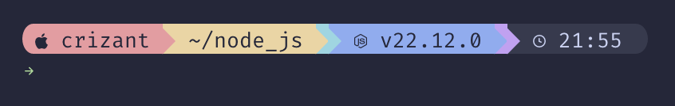

# starship_catppuccin_rainbow

A starship color scheme based on [Gruvbox Rainbow](https://starship.rs/presets/gruvbox-rainbow) using [Catppuccin](https://github.com/catppuccin) palette.

## Prerequisites

- [Starship Prompt](https://starship.rs)
- Nerd fonts (e.g. [FiraCode Nerd Font](https://formulae.brew.sh/cask/font-fira-code-nerd-font) or [JetBrains Mono Nerd Font](https://formulae.brew.sh/cask/font-jetbrains-mono-nerd-font))

## Installation

Put the `starship.toml` file in your `~/.config/starship.toml`.